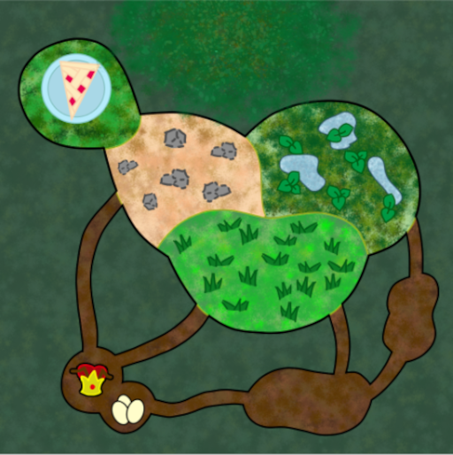
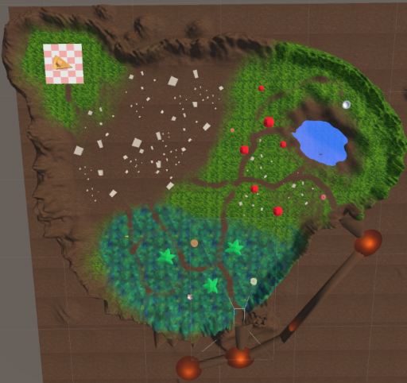
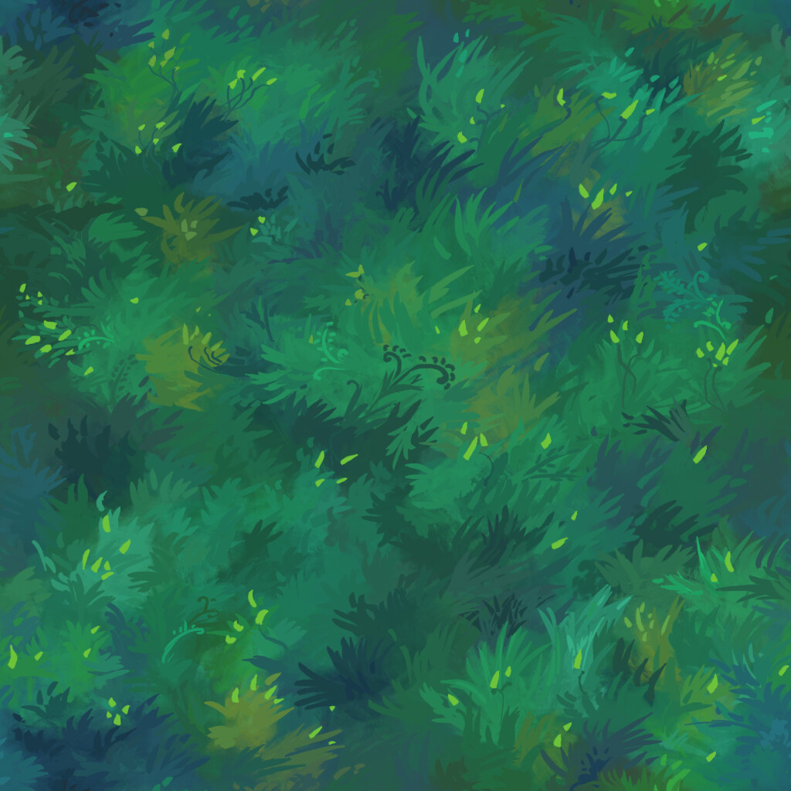
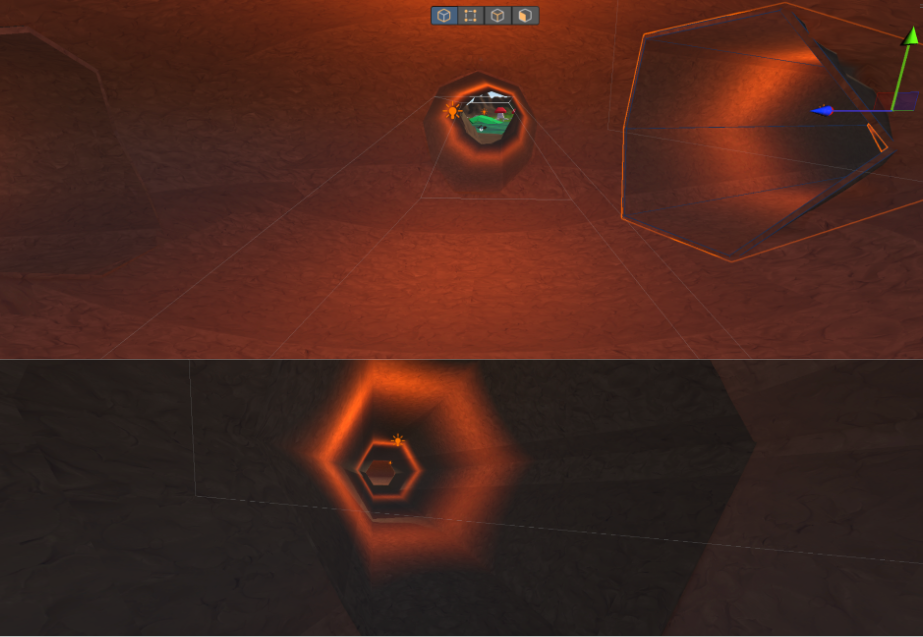
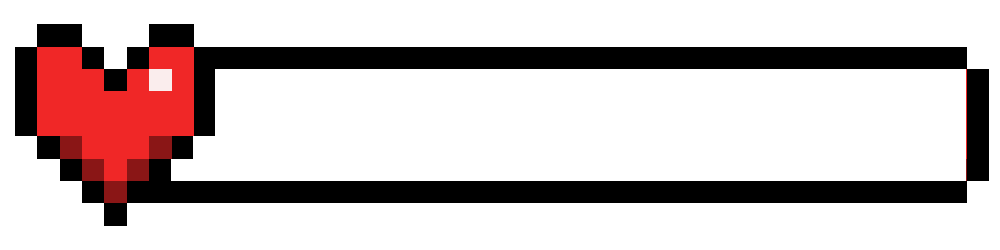
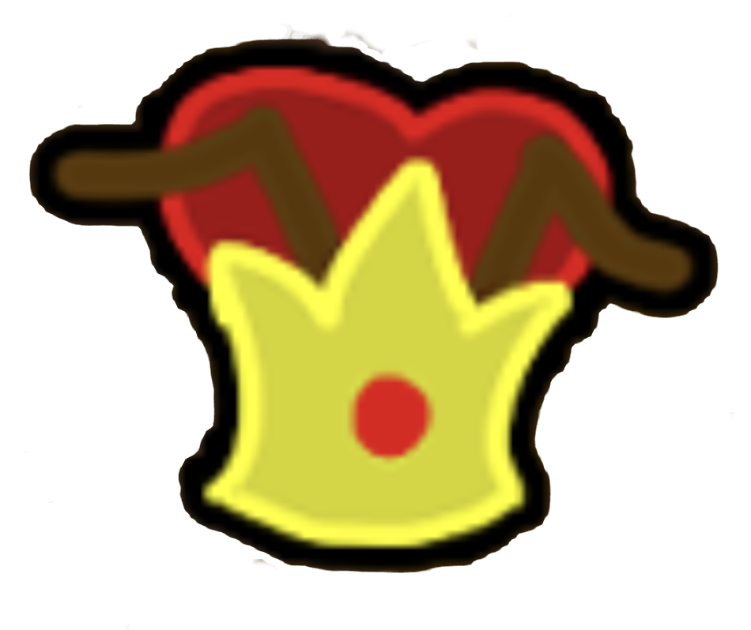
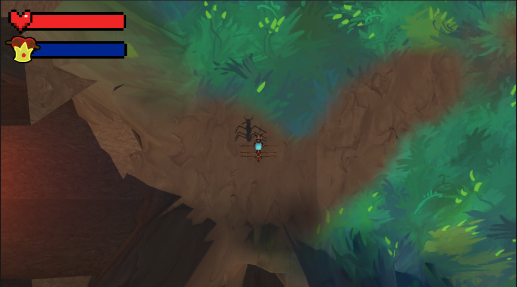

# Final Standt


Created by: Edward Garcia and Luis Velázquez and Bryan Guevara

## Description

This project is for the class of video game programming. The game is a 3d top down game where the player controls an ant and has to gather food for the colony before it starves. The player has to fight dangerous enemies and explore the map to find food. The player has to be careful because the player can also starve. The player has to find food and bring it back to the colony.
## Documentation

### World Map:

The map was made with 3d object, terrain. The dimentions of the map is 256 x 256. We used this illustration to make the biomes of the map.

 

We used the terrain tools to make the map look more natural. We used the following textures:




We didn't want to use textures that were too realistic because we wanted to keep the game in a low poly style. We added some assest to make the map more interesting and to make it look more natural. We added rocks, leafs, water and other things.

We also added a tunnel system to the map. This was to simulate the ant colony. We made use of th probuilder tool to make the tunnels. With the cone we were able to make the tunnel entrances and connections to the eliptical chambers. These chambers were made with the sphere tool and set the normals to the inside. We also placed some lights inside of the tunnels to make it look more interesting. We chose an amber lights to make it look like natural glowing fungus or something similar to give light to the tunnels.



Most of the work was done with the help of the code writen in class, like the player script and the new input system.

### HUD:

The creation of the HUD was done with the use of some helpful material form YouTube. Here we created two distinct health related bars of health. One health bar was for the Players health:



This is a simple png image where the background is transparent. 

For the queen we used the same image but with the queens logo on top,



The HUD was made using the UI elements from Unity and some creativity. We created a an Image UI element and the sprite we chose for that image was the emply health bar. We added another element to that HUD element that was just a simple block color. We chose to color it red to represent the players health. Then for the creation of the queen/colonies health we chose the color blue to differentiate.




#### Code for the HUD:

We also made some code for the health bar to update. For the player if the player has damage then he will lose life and the health bar will update. 

Using slider and the health bar we were able to make the health bar update. We used the slider to update the health bar. We also added a script to the player to update the health bar. We used the same script for the queen. 

```c#
using System.Collections;
using System.Collections.Generic;
using UnityEngine;
using UnityEngine.UI;

public class HealthBar : MonoBehaviour
{
    public Slider slider;
    public void SetMaxHealth(int health)
    {
        slider.maxValue = health;
        slider.value = health;
    }
    public void SetHealth(int health)
    {
        slider.value = health;
    }

    
}
```
Player life update:

Set the max health and the current health to the max health. Here the anytime the player takes damage the health bar will update.
```c#
using System.Collections;
using System.Collections.Generic;
using UnityEngine;
using UnityEngine.Events;

public class Life : MonoBehaviour
{
    public int maxHealth = 100;
    public int currentHealth;
    public HealthBar healthBar;

    public UnityEvent onDeath; 
// Start is called before the first frame update
    void Start()
    {
    currentHealth = maxHealth;
    healthBar.SetMaxHealth(maxHealth);

    }
// Update is called once per frame
    void Update()
    {
        if (Input.GetKeyDown(KeyCode.Space)){
            TakeDamage(20);
        }
        if ( currentHealth <= 0 )
        {
            onDeath.Invoke();
            Destroy(gameObject);
        }
    }

    void TakeDamage (int damage)
    {
    currentHealth -= damage;
    healthBar.SetHealth(currentHealth);
    }
}
```

Queen life update:
Here we set it up similar to the player but the queen doesn't take damage, but slowly loses health over time. Every 10 seconds the queen will lose 1 health.

```c#
using System.Collections;
using System.Collections.Generic;
using UnityEngine;

public class QueenLife : MonoBehaviour
{
    public int maxHealth = 100;
    public int currentHealth;
    public QueenHealth healthBar;
// Start is called before the first frame update
    void Start()
    {
    currentHealth = maxHealth;
    healthBar.SetMaxHealth(maxHealth);
    
    }
// Update is called once per frame
    void Update()
    {
        // every 10 seconds the queen will lose 1 health
        if (Time.frameCount % 600 == 0){
            TakeDamage(1);
        }
    }

    void TakeDamage (int damage)
    {
    currentHealth -= damage;
    healthBar.SetHealth(currentHealth);
    }
}
```
Queen health bar script:

Same as the health bar of the player but a for the queen.

```c#
using System.Collections;
using System.Collections.Generic;
using UnityEngine;
using UnityEngine.UI;

public class QueenHealth : MonoBehaviour
{
    public Slider slider;
    public void SetMaxHealth(int health)
    {
        slider.maxValue = health;
        slider.value = health;
    }
    public void SetHealth(int health)
    {
        slider.value = health;
    }

    
}
```

### the player

Controls:

In this game we could use part of the player script done in class, mainly the new input system. This helped a lot in speeding up the process of coding. Apart from that, the player follows the mouse as the model will always face where the mouse is pointing. that meaans when the player presses W it will move towards the mouse pointer, S moves the player away from it, etc. this is all done on the update function.

```c#
    void Update()
    {   
        // follows mouse pointer
        mousePos = Mouse.current.position.ReadValue();
        mousePos.z = 100f;
        mousePos = cam.ScreenToWorldPoint(mousePos) - transform.position;

        // other stuff
        transform.Translate(movementValue.x * Time.deltaTime, 0, movementValue.y * Time.deltaTime);
        transform.rotation = Quaternion.LookRotation(mousePos, Vector3.up); 
    }
```

Camera:

For the camera, instead of normaly rotate with the player we had to detatch it, but by doing so it stopped following the player, we then implemented Cinemachine to fix out problem. The fascinating thing about cinemachine is the fact that you dont have to program or code anything for it to work. Cinemachine has a lot of amazing things ranging from, following a model, changing camera perspectives, doing cutscenes; so it was right up our alley. 

Enemies:

For the enemy ants, (all the blue-colored ants) add an Enemy class to each one, and an EnemyManager that keeps count of how many enemies are on the map. Also took the EnemyFSM code that we made in class and changed it to have three states, 1. Move randomly around the map which is the default, 2. Chase the player when the player gets within range, and 3. Attack the player when the player gets within attack range
Enemy~
```c#
    public class Enemy : MonoBehaviour
{
    // Start is called before the first frame update
    void Start(){
        EnemyManager.instance.AddEnemy(this);
    }

    void OnDestroy(){
        EnemyManager.instance.RemoveEnemy(this);
    }
}
```
EnemyManager~
```c#
    public class EnemyManager : MonoBehaviour
{
    public static EnemyManager instance;
    public List<Enemy> enemies;
    public UnityEvent onChanged;

    // Simpleton design pattern.
    void Awake(){
        if(instance == null){
            instance = this;
        }
        else{
            Debug.LogError("Duplicated Enemy Manager",gameObject);
        }
    }

    public void AddEnemy(Enemy enemy){
        enemies.Add(enemy);
        onChanged.Invoke();
    }

    public void RemoveEnemy(Enemy enemy){
        enemies.Remove(enemy);
        onChanged.Invoke();
    }
}
```
EnemyFSM~
```c#
    public class EnemyFSM : MonoBehaviour
{
    public enum EnemyState{MoveRandomly,ChasePlayer,AttackPlayer};
    public EnemyState currentState;
    public Sight sightSensor;
    public float playerAttackDistance;
    public float moveSpeed = 5f;
    public float chaseRange = 5f;
    public float rotationSpeed = 2f;
    private Vector3 destination;
    
    private void Awake()
    {
        currentState = EnemyState.MoveRandomly;
    }
    void Update()
    {
        switch (currentState)
        {
        case EnemyState.MoveRandomly:
            MoveRandomly();
            break;
        case EnemyState.ChasePlayer:
            ChasePlayer();
            break;
        case EnemyState.AttackPlayer:
            AttackPlayer();
            break;
        }
    }
    void LookTo(Vector3 targetPosition)
    {
        Vector3 directionToPosition = Vector3.Normalize(targetPosition - transform.parent.position);
        directionToPosition.y = 0;
        transform.parent.forward = directionToPosition;
    }
    void MoveRandomly()
    {
        if(sightSensor.detectedObject != null)
        {
            currentState = EnemyState.ChasePlayer;
        }
        // Move randomly in one direction
        transform.Translate(Vector3.forward * moveSpeed * Time.deltaTime);

        // Rotate to move randomly in another direction
        transform.Rotate(Vector3.up * Random.Range(-180f, 180f) * rotationSpeed * Time.deltaTime);
    }

    

    void ChasePlayer()
    {
        LookTo(sightSensor.detectedObject.transform.position);
        if(sightSensor.detectedObject == null)
        {
            currentState = EnemyState.MoveRandomly;
            return;
        }
        //verifies if the player is in range to attack
        float distanceToPlayer = Vector3.Distance(transform.position, sightSensor.detectedObject.transform.position);
        if(distanceToPlayer <= playerAttackDistance)
        {
            currentState = EnemyState.AttackPlayer;
        }
    }

    void AttackPlayer()
    {
        if(sightSensor.detectedObject == null)
        {
            currentState = EnemyState.MoveRandomly;
            return;
        }

        float distanceToPlayer = Vector3.Distance(transform.position, sightSensor.detectedObject.transform.position);
        if(distanceToPlayer > playerAttackDistance* 1.1)
        {
            currentState = EnemyState.ChasePlayer;
        }
    }

    void OnDrawGizmos()
    {
        Gizmos.color = Color.blue;
        Gizmos.DrawWireSphere(transform.position, playerAttackDistance);
        
    }
}
```
